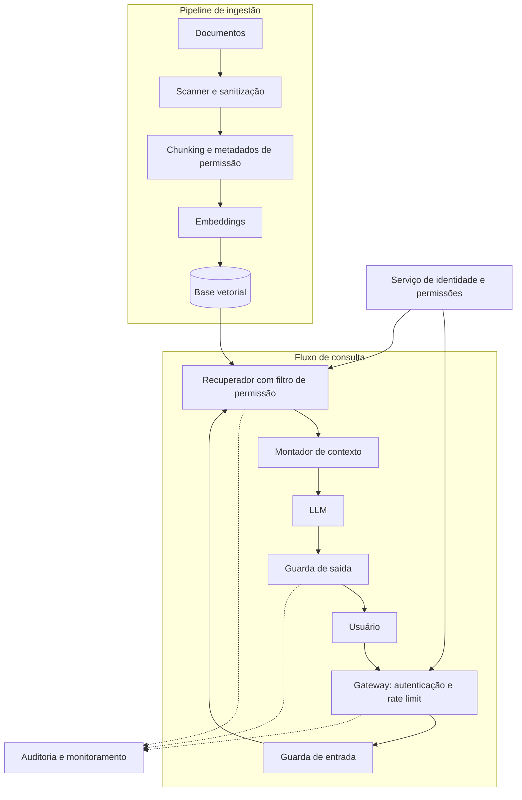

# Segurança em Sistemas Conversacionais com RAG: Proposta de Arquitetura em Camadas

## 1. Introdução

Sistemas conversacionais baseados em modelos de linguagem de grande porte (LLMs) passaram a ser amplamente adotados em atendimento e consulta a conhecimento interno. Uma das arquiteturas mais comuns é a geração aumentada por recuperação (*Retrieval-Augmented Generation*, RAG), na qual o sistema busca trechos relevantes em uma base de documentos e os entrega ao modelo como contexto para formular a resposta (LEWIS et al., 2020). Essa abordagem permite que o chatbot responda com base em informações da organização sem a necessidade de retreinar o modelo.

Este trabalho considera um chatbot corporativo de atendimento e consulta interna com RAG, cuja base reúne documentos como políticas, contratos e registros que podem conter dados pessoais de clientes. Os usuários possuem papéis distintos e, portanto, níveis de acesso diferentes às informações.

A arquitetura RAG introduz riscos de segurança que vão além do modelo em si. O primeiro é a **injeção indireta de prompt**. LLMs não distinguem de forma confiável instruções legítimas de dados recuperados. Assim, um documento que contenha texto malicioso, como uma instrução oculta em um PDF ou em uma página indexada, pode ser interpretado como comando pelo modelo. Diferentemente da injeção direta, em que o atacante é o próprio usuário, na injeção indireta o ataque vem de conteúdo externo que o sistema consome, sem que o usuário perceba (GRESHAKE et al., 2023). Há ainda o risco de **envenenamento da base de conhecimento**, em que um invasor insere documentos manipulados para induzir respostas específicas (ZOU et al., 2024).

O segundo problema é o **acesso a dados sem permissão**. Em muitas implementações, documentos de diferentes níveis de confidencialidade são indexados juntos na mesma base vetorial. Se a recuperação não respeita as permissões do usuário, uma pergunta bem formulada pode trazer ao contexto, e depois à resposta, conteúdo que ele não deveria ver. A lista de riscos do OWASP para aplicações com LLMs inclui tanto a injeção de prompt quanto a divulgação de informações sensíveis entre as principais categorias (OWASP, 2025).

Esses riscos têm consequências diretas. Há impacto na confidencialidade, quando dados sensíveis vazam; na integridade, quando respostas são manipuladas; e na reputação e conformidade da organização. No Brasil, a Lei Geral de Proteção de Dados (LGPD) estabelece os princípios da segurança e da prevenção, exigindo medidas técnicas para proteger dados pessoais contra acessos não autorizados (BRASIL, 2018). O *AI Risk Management Framework* do NIST também recomenda que riscos de sistemas de IA sejam identificados e tratados de forma contínua ao longo do ciclo de vida (NIST, 2023).

Observa-se, portanto, uma lacuna: a segurança desses sistemas costuma ser tratada apenas na camada do modelo, enquanto boa parte do risco está na arquitetura ao redor, isto é, na ingestão de documentos, na recuperação e no controle de acesso. Este trabalho propõe uma arquitetura em camadas que combina controles determinísticos, como o filtro de permissões, com controles probabilísticos, como detectores de injeção.

---

## 2. Solução Proposta

### 2.1 Diagrama de arquitetura

### 2.2 Responsabilidades dos módulos

| Módulo | Responsabilidade | Ameaça que mitiga |
|---|---|---|
| Scanner e sanitização | Inspeciona documentos antes da indexação: detecta padrões de instrução embutida, texto oculto e origem não confiável. Documentos suspeitos vão para quarentena e revisão. | Injeção indireta, envenenamento da base |
| Chunking e metadados de permissão | Divide os documentos e associa a cada trecho a origem e o nível de acesso necessário. | Base para o controle de acesso |
| Embeddings e base vetorial | Armazena os vetores junto com os metadados, permitindo busca com filtro. | Mistura de dados de níveis distintos |
| Gateway | Autentica o usuário, aplica limites de requisição e propaga a identidade para os demais módulos. | Acesso anônimo, abuso, extração em massa |
| Serviço de identidade e permissões | Fonte única de verdade sobre quem pode acessar o quê. | Acesso indevido, permissões inconsistentes |
| Guarda de entrada | Filtra tentativas evidentes de injeção direta e de extração de dados na pergunta do usuário. | Jailbreak, injeção direta |
| Recuperador com filtro de permissão | Aplica as permissões do usuário durante a busca, de modo que trechos não autorizados nunca cheguem ao modelo. | Acesso a dados sem permissão |
| Montador de contexto | Delimita os trechos recuperados como conteúdo não confiável e instrui o modelo a tratá-los somente como dados, não como instruções. | Injeção indireta |
| LLM | Gera a resposta com base apenas no contexto recebido, sem acesso direto a ferramentas ou a dados fora dele. | Limita o dano caso uma injeção tenha sucesso |
| Guarda de saída | Verifica se a resposta contém dados pessoais ou sensíveis e se respeita a política da organização, bloqueando ou mascarando quando necessário. | Vazamento de dados na resposta |
| Auditoria e monitoramento | Registra consultas, trechos recuperados e bloqueios para detecção e investigação de incidentes, minimizando o registro de dados pessoais. | Falta de rastreabilidade, ataques persistentes |

### 2.3 Decisões de projeto

**Filtro de permissão na recuperação, e não depois.** Aplicar o filtro durante a busca vetorial (pré-filtragem por metadados) garante que conteúdo não autorizado nunca entre no contexto do modelo. Filtrar apenas após a recuperação ou na resposta depende de o modelo ou de um verificador "não esquecer" de remover algo, o que é mais frágil. Como camada adicional, a guarda de saída funciona como segunda verificação (defesa em profundidade).

**Hierarquia de confiança entre controles.** O filtro de permissão é determinístico e, por isso, é o controle mais robusto. Detectores de injeção e guardas de entrada e saída são probabilísticos e podem ser contornados, então devem ser vistos como camadas complementares, não como garantia.

**Princípio do menor privilégio.** O LLM não recebe ferramentas nem acesso direto a bancos de dados. Mesmo que uma injeção seja bem-sucedida, o dano fica restrito ao que o usuário já podia ver e à geração de texto.

---

## 3. Conclusão

A proposta endereça os dois problemas centrais identificados: a injeção indireta, tratada na ingestão e na montagem do contexto, e o acesso indevido a dados, tratado no recuperador com filtro de permissão. A principal força da arquitetura é combinar um controle determinístico (permissões) com camadas probabilísticas (detectores), de modo que a falha de uma não comprometa todo o sistema.

Há limitações. Nenhum detector elimina completamente a injeção de prompt, então a proposta reduz o risco e o impacto, mas não o zera. Mais camadas também aumentam a latência e o custo, e filtros agressivos podem gerar falsos positivos que prejudicam a experiência do usuário. Além disso, a segurança depende da qualidade dos metadados de permissão: se a classificação dos documentos estiver errada, o filtro será correto, porém ineficaz.

Quanto ao esforço de implementação, estimo que um protótipo funcional seja viável em poucas semanas por uma equipe pequena, usando bases vetoriais que já oferecem filtragem por metadados e integração com o provedor de identidade existente. O maior esforço está em etapas menos visíveis: classificar e etiquetar o acervo de documentos, calibrar os filtros para equilibrar segurança e usabilidade, e manter o monitoramento contínuo. Eu começaria pelo filtro de permissão e pela auditoria, que têm o melhor custo-benefício, e só depois adicionaria o scanner de ingestão e as guardas de entrada e saída.

---

## 4. Referências Bibliográficas

BRASIL. **Lei nº 13.709, de 14 de agosto de 2018**. Lei Geral de Proteção de Dados Pessoais (LGPD). Brasília, DF: Presidência da República, 2018. Disponível em: https://www.planalto.gov.br/ccivil_03/_ato2015-2018/2018/lei/l13709.htm. Acesso em: [dd mês. 2026].

GRESHAKE, Kai *et al*. Not what you've signed up for: compromising real-world LLM-integrated applications with indirect prompt injection. **arXiv**, 2023. Disponível em: https://arxiv.org/abs/2302.12173. Acesso em: [dd mês. 2026].

LEWIS, Patrick *et al*. Retrieval-augmented generation for knowledge-intensive NLP tasks. **arXiv**, 2020. Disponível em: https://arxiv.org/abs/2005.11401. Acesso em: [dd mês. 2026].

NATIONAL INSTITUTE OF STANDARDS AND TECHNOLOGY (NIST). **Artificial Intelligence Risk Management Framework (AI RMF 1.0)**. Gaithersburg, MD: NIST, 2023. (NIST AI 100-1). Disponível em: https://doi.org/10.6028/NIST.AI.100-1. Acesso em: [dd mês. 2026].

OWASP FOUNDATION. **OWASP Top 10 for Large Language Model Applications**. [S. l.]: OWASP, 2025. Disponível em: https://genai.owasp.org/llm-top-10/. Acesso em: [dd mês. 2026].

ZOU, Wei *et al*. PoisonedRAG: knowledge corruption attacks to retrieval-augmented generation of large language models. **arXiv**, 2024. Disponível em: https://arxiv.org/abs/2402.07867. Acesso em: [dd mês. 2026].
