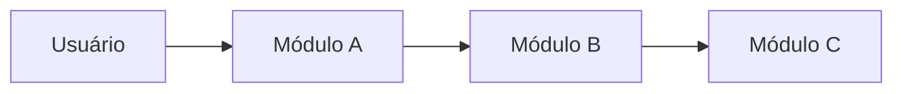

# Segurança em Sistemas Conversacionais: Proposta de Melhoria

## 1. Introdução

<!-- Qual é o sistema conversacional considerado? Qual o contexto de uso e quais dados ele trata? -->

<!-- Qual é o problema de segurança? Que ameaças existem (ex.: prompt injection, vazamento de dados, jailbreak, abuso de ferramentas)? -->

<!-- Por que isso importa? Impactos para usuários, organização e conformidade (ex.: LGPD). -->

<!-- Cada afirmação importante precisa de fonte, citada no texto em ABNT (AUTOR, ano). -->

## 2. Solução Proposta

### 2.1 Diagrama de arquitetura

<!-- Mostre onde cada controle de segurança entra no fluxo. -->

### 2.2 Responsabilidades dos módulos

| Módulo | Responsabilidade | Ameaça que mitiga |
|--------|------------------|-------------------|
| A | | |
| B | | |
| C | | |

<!-- Opcional: um parágrafo por módulo explicando decisões e trade-offs. -->

## 3. Conclusão

<!-- Sua avaliação: a proposta resolve o problema? Quais as limitações? -->

<!-- Esforço de implementação: o que seria necessário (tempo, equipe, custo, complexidade)? Por onde começaria? -->

## 4. Referências Bibliográficas

<!-- Formato ABNT (NBR 6023), em ordem alfabética. Exemplo de estrutura:
SOBRENOME, Nome. Título: subtítulo. Edição. Local: Editora, ano.
SOBRENOME, Nome. Título do artigo. Nome do periódico, v. X, n. Y, p. 00-00, ano. Disponível em: URL. Acesso em: dd mês. aaaa. -->
